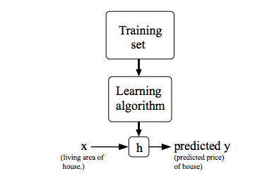
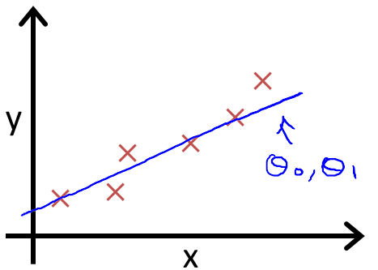
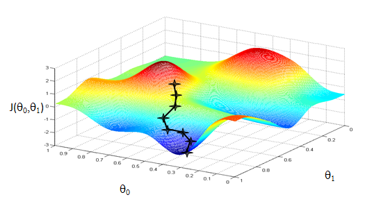

# 机器学习笔记
-----------

## 单变量的线性回归方程

在开始讨论具体步骤之前，首先给出简要的思维路线：

1. 拥有一个点集，为了得到一条最佳拟合的直线；
2. 通过“最小二乘法”来衡量拟合程度，得到代价方程；
3. 利用“梯度下降算法”使得代价方程取得极小值点；

### 概念

回归在数学上来说是给定一个点集，能够用一条曲线去拟合之。如果这个曲线是一条直线，那就被称为线性回归；如果曲线是一条二次曲线，就被称为二次回归，回归还有很多的变种，如locally weighted回归，logistic回归等等。

课程中得到的h就是线性回归方程：

下面，首先来介绍一下单变量的线性回归：

问题是这样的：给定一个点集，找出一条直线去拟合，要求拟合的效果达到最佳（最佳拟合）。

既然是直线，我们先假设直线的方程为：$h_\theta=\theta_0+\theta_1x$

如图:

点集有了，直线方程有了，接下来，我们要做的就是计算出$\theta_0$和$\theta_1$，使得拟合效果达到最佳（最佳拟合）。

那么，拟合效果的评判标准是什么呢？换句话说，我们需要知道一种对拟合效果的度量。

在这里，我们提出**“最小二乘法”**：（以下摘自wiki）

>利用最小二乘法可以简便地求得未知的数据，并使得这些求得的数据与实际数据之间误差的平方和为最小。

对于“最小二乘法”就不再展开讨论，只要知道他是一个度量标准，我们可以用它来评判计算出的直线方程是否达到了最佳拟合就够了。

那么，回到问题上来，在单变量的线性回归中，这个拟合效果的表达式是利用最小二乘法将未知量残差平方和最小化：

$$\sum_{i=1}^n\epsilon_i^2=\sum_{i=1}^n(y_i-\alpha-\beta x_i)^2$$

结合课程，定义了一个成本函数：

>Hipothesis:
>$$h_\theta=\theta_0+\theta_1x$$
>Parameters:
>$$\theta_0, \theta_1$$
>Cost Function:
>$$J(\theta_0, \theta_1)=\frac 1{2m}\sum_{i=1}^m\left(h_\theta(x^{(i)})-y^{(i)}\right)^2$$
>Goal:
>$$min_{\theta_0,\theta_1} J(\theta_0, \theta_1)$$

其实，到这里，要是把点集的具体数值代入到成本函数中，就已经完全抽象出了一个高等数学问题（解一个二元函数的最小值问题）。

$$min J(\theta_0, \theta_1)=a\theta_0^2+b\theta_0\theta_1+c\theta_1^2+d\theta_0+e\theta_1+f$$

其中，a,b,c,d,e,f均为已知。

课程中介绍了一种叫“Gradient descent”的方法——**梯度下降算法**:

>Have some function $J(\theta_0, \theta_1)$
>
>Want $min_{\theta_0, \theta_1}J(\theta_0, \theta_1)$
>
>Outline
>
>- Start with some $\theta_0, \theta_1$
>- Keep changing $\theta_0, \theta_1$ to reduce $J(\theta_0, \theta_1)$ until we hopefully end up at a minimum

所谓梯度下降算法（一种求局部最优解的方法），举个例子就好比你现在在一座山上，你想要尽快地到达山底（极小值点），这是一个下降的过程，这里就涉及到了两个问题：1）你下山的时候，跨多大的步子（当然，肯定不是越大越好，因为有一种可能就是你一步跨地太大，正好错过了极小的位置）；2）你朝哪个方向跨步（注意，这个方向是不断变化的，你每到一个新的位置，要判断一下下一步朝那个方向走才是最好的，但是有一点可以肯定的是，要想尽快到达最低点，应从最陡的地方下山）。

那么，什么时候算是你到了一个极小点呢，显然，当你所处的位置发生的变化不断减小，直至收敛于某一位置，就说明那个位置就是一个极小值点。

两张图说明算法的基本思想：

